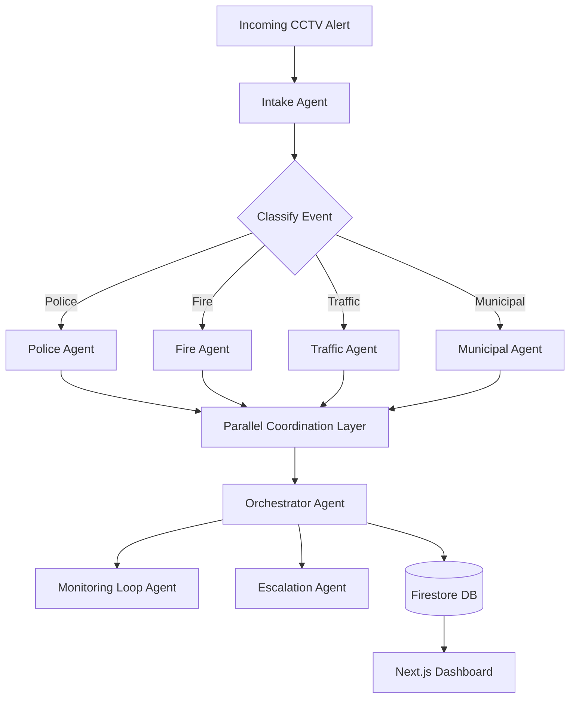
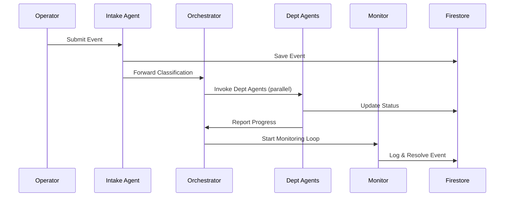

# 📡 **Mini-ICCC: AI-Powered Smart City Coordination System**

### Real-Time Multi-Agent Emergency Coordination for Smart Cities


---

# 🚨 **1. Problem Statement**

India’s Smart Cities depend on ICCCs, but:

* 🕒 **Emergency responses are 30% slower** due to lack of real-time coordination
* 🧩 Departments (Police, Traffic, Fire, Utilities) operate in **isolated silos**
* 💸 ICCCs cost **₹2–3 crore per year** to operate, risking sustainability
* 🔄 Over-reliance on manual decisions reduces efficiency
* ⚠️ Many ICCCs lack automation, real-time sync, and scalable intelligence
* 📉 Without coordination automation → ICCCs risk becoming financial liabilities

👉 **Core Problem:**
**Enable automated, real-time, multi-department decision making without manual delays.**

---

# 💡 **2. Mini-ICCC Solution**

A fully functional, Firebase-powered, multi-agent coordination system that:

✨ Processes events
⚡ Classifies severity
🚓 Dispatches Police/Fire/Traffic/Municipal agents (parallel)
🔁 Uses loop agents for continuous monitoring
📈 Escalates automatically
📥 Logs every agent action
📊 Updates dashboard in real-time

---

# 🧠 **3. Why Multi-Agent Architecture?**

Agents enable:

* 🔥 Real-time reasoning
* 🧵 Parallel execution across departments
* 🧠 Autonomous decisions powered by LLM
* 🔁 Loop-based monitoring until the event resolves
* 🚨 Escalations without human intervention
* 🔍 Observability through logs and metrics

---

# 🏗️ **4. System Architecture**

## **High-Level Architecture** (Mermaid UML)



---

# 🗂️ **5. Firestore Collections (Enterprise-Grade Design)**

## 📝 **`events`**

| Field               | Type          |
| ------------------- | ------------- |
| eventId             | string        |
| title               | string        |
| description         | string        |
| severity            | number        |
| status              | string        |
| assignedDepartments | array<string> |
| createdAt           | timestamp     |
| location            | map(lat, lng) |
| detectedBy          | string        |

**Indexes**

* status + createdAt
* severity + createdAt
* assignedDepartments + status

---

## 🧠 **`agents_logs`**

| Field         | Type               |
| ------------- | ------------------ |
| agentId       | string             |
| eventId       | reference → events |
| log           | string             |
| stateSnapshot | map                |
| timestamp     | timestamp          |

---

## 🏢 **`departments`**

| Field       | Type    |
| ----------- | ------- |
| deptId      | string  |
| name        | string  |
| online      | boolean |
| currentLoad | number  |

---

## 👤 **`users`**

| Field      | Type                    |            |
| ---------- | ----------------------- | ---------- |
| uid        | string                  |            |
| name       | string                  |            |
| role       | `admin`                 | `operator` |
| email      | string                  |            |
| department | reference → departments |            |

---

# 🔐 **6. Firestore Security Rules**

```js
rules_version = '2';
service cloud.firestore {
  match /databases/{database}/documents {

    match /users/{uid} {
      allow read, write: if request.auth.uid == uid;
    }

    match /events/{eventId} {
      allow read: if request.auth != null;
      allow write: if request.auth != null;
    }

    match /agents_logs/{logId} {
      allow read: if request.auth.token.role == "admin";
      allow write: if request.auth != null;
    }

    match /departments/{id} {
      allow read: if request.auth != null;
      allow write: if request.auth.token.role == "admin";
    }
  }
}
```

---

# ⚙️ **7. Multi-Agent Workflow**



---

# 🎨 **8. UI/UX – Professional Dashboard (Next.js + TailwindCSS)**

### 🎯 **Theme**

* Primary: `#0046D5`
* Accent: `#00A8E8`
* BG: `#F8FAFC`

### 📱 **Responsive Design**

* Sidebar (220px)
* Cards (min 350px)
* Buttons 48px height
* Mobile-first grid layout

### 🖥️ Screens

* Login (Firebase Auth)
* Events Dashboard
* Event Details (with live agent logs)
* Department Load Monitor
* Agent Activity Timeline

Icons powered by **Icons8** — e.g.,
 
, , 

---

# 🧪 **9. Key Course Concepts Demonstrated**

| Concept            | Status               |
| ------------------ | -------------------- |
| Multi-agent system | ✅                    |
| Parallel agents    | ✅                    |
| Sequential agents  | ✅                    |
| Loop agents        | ✅                    |
| Custom tools       | Firebase Actions     |
| Long-running ops   | Monitoring Loop      |
| Sessions & state   | Firestore Context    |
| Memory             | Compact event memory |
| Observability      | Logs + metrics       |
| Agent evaluation   | Included             |
| A2A protocol       | Yes                  |
| Deployment         | Firebase Hosting     |

---

# 📈 **10. Target Customers**

* Smart City Agencies
* Municipal Corporations
* Police Departments
* Fire & Rescue
* Traffic Control Centers
* Airports / Tech Parks / SEZs

---

# 🧭 **11. SWOT Analysis**

### **Strengths**

* Real-time automation
* Zero-cost infrastructure
* Scalable multi-agent logic

### **Weaknesses**

* Prototype-level CV input

### **Opportunities**

* Integration with drones / IoT cameras
* State-wide smart-city deployments

### **Threats**

* Competing smart surveillance platforms

---

# ⚙️ **12. Setup Instructions**

1. Clone the repo
2. Create Firebase project
3. Add Firestore & Auth
4. Add the provided security rules
5. Add Firebase config to `.env`
6. Run

```
npm install
npm run dev
```

---

