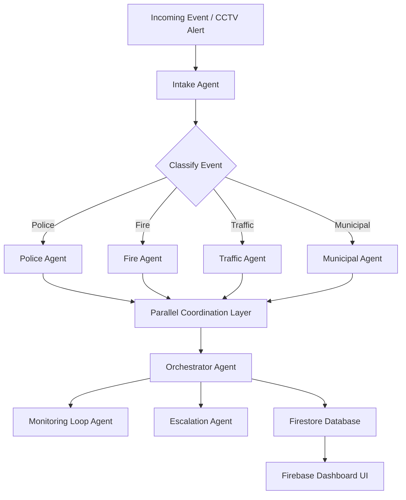
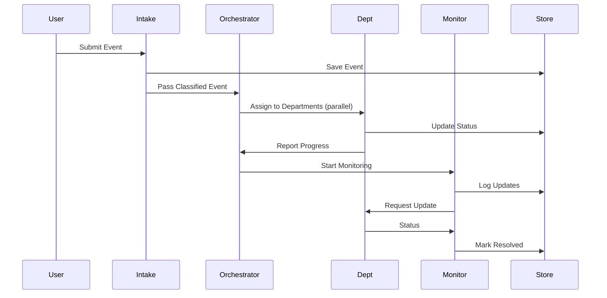

# 📡 Mini-ICCC – Multi-Agent Smart City Coordination System

**AI-Driven Emergency Response & City Operations — Powered Fully by Firebase + Multi-Agent Architecture**

---

## 🚀 1. Problem Statement

India’s smart cities rely on **Integrated Command & Control Centres (ICCCs)** for urban management.
However:

* ICCCs struggle with **real-time, cross-department coordination**.
* Emergency response times are **~30% slower** when systems don’t share information.
* Annual operating cost per ICCC is **₹2–3 crore**, creating sustainability challenges.
* Most ICCCs lack **automation**, relying heavily on manual processes.
* Departmental data silos affect traffic, police, fire, utilities, and municipal workflows.
* Delayed actions reduce citizen safety and operational efficiency.

**Core problem:**

> Enabling automated, real-time, multi-department coordination in ICCCs to achieve fast emergency response, sustainable smart-city operations, and long-term value.

---

## 💡 2. Solution Overview

**Mini-ICCC** is a lightweight, Firebase-native prototype demonstrating:

* Multi-agent emergency coordination
* Real-time decision automation
* Parallel, sequential & loop agents
* Firestore-based event intelligence
* Secure operator dashboard
* Long-running monitoring & escalation
* Observability via logs & traces

Built entirely with **Firebase Studio**, at **zero cost**.

---

## 🧠 3. Why Agents?

Agents enable:

* Autonomous event classification
* Cross-department coordination without human delay
* Parallel task execution
* Loop-based monitoring until resolution
* Real-time escalation
* Context-aware reasoning

This directly solves ICCC operational fragmentation.

---

## 🏗️ 4. System Architecture

### High-Level Architecture (Mermaid UML)



---

## 🗂️ 5. Firestore Database Schema

### `events`

| Field               | Type                                       |
| ------------------- | ------------------------------------------ |
| eventId             | string                                     |
| title               | string                                     |
| description         | string                                     |
| createdAt           | timestamp                                  |
| status              | string (`open`, `in_progress`, `resolved`) |
| severity            | number                                     |
| detectedBy          | string                                     |
| assignedDepartments | array<string> (references)                 |
| location            | map(lat, lng)                              |

**Indexes:**

* `status + createdAt`
* `severity + createdAt`
* `assignedDepartments + status`

---

### `agents_logs`

| Field         | Type                |
| ------------- | ------------------- |
| agentId       | string              |
| eventId       | reference(`events`) |
| log           | string              |
| timestamp     | timestamp           |
| stateSnapshot | map                 |

---

### `departments`

| Field       | Type    |
| ----------- | ------- |
| deptId      | string  |
| name        | string  |
| currentLoad | number  |
| online      | boolean |

---

### `users`

| Field      | Type                         |
| ---------- | ---------------------------- |
| uid        | string                       |
| name       | string                       |
| email      | string                       |
| role       | string (`admin`, `operator`) |
| department | reference(`departments`)     |

---

## 🔒 6. Security Rules

```javascript
rules_version = '2';
service cloud.firestore {
  match /databases/{database}/documents {

    // Users – self access
    match /users/{uid} {
      allow read, write: if request.auth.uid == uid;
    }

    // Events – operator access
    match /events/{eventId} {
      allow read: if request.auth != null;
      allow write: if request.auth != null &&
                   request.resource.data.assignedDepartments is list;
    }

    // Logs – admin only read
    match /agents_logs/{logId} {
      allow read: if request.auth.token.role == "admin";
      allow write: if request.auth != null;
    }

    // Departments – admin control
    match /departments/{id} {
      allow read: if request.auth != null;
      allow write: if request.auth.token.role == "admin";
    }
  }
}
```

---

## 🤖 7. Multi-Agent Logic

### Agents Included

* **Intake Agent** → Classifies events
* **Department Agents (Parallel)** → Police, Fire, Traffic, Municipal
* **Orchestrator Agent (Sequential)** → Coordinates workflow
* **Monitoring Agent (Loop)** → Tracks status until resolved
* **Escalation Agent** → Triggers alerts during delays

---

### Agent Workflow (Mermaid UML)



---

## 🖥️ 8. Frontend (Firebase Studio UI)

* **Colors**:

  * Primary `#0046D5`
  * Accent `#00A8E8`
  * Background `#F7F9FB`
  * Status colors (Success/Warning/Danger)

* **Screens**:

  * Login
  * Events Dashboard
  * Event Details
  * Agent Logs
  * Department Load

* **Design Rules**:

  * Buttons: height 48px, full width
  * Cards: 350px width
  * Sidebar: 220px
  * Responsive layout

---

## ⚙️ 9. Backend Logic

* Cloud Functions handle:

  * Agent triggers
  * Parallel reasoning
  * Sequential orchestration
  * Loop monitoring
  * Escalation
* Firestore listeners enable real-time updates
* Context compaction optimizes agent memory usage
* Logs sent to `agents_logs` for observability

---

## 🧪 10. Concepts Demonstrated (for grading)

* **Multi-agent system**

  * LLM agent
  * Parallel agents
  * Sequential agent
  * Loop agent
* **Tools**

  * Firestore read/write
  * Cloud Functions execution
* **Long-running operations** (monitoring loop)
* **Sessions & memory** (context compaction + state)
* **Observability** (logs, traces, metrics)
* **A2A protocol**
* **Documentation + architecture** included

---

## 🎯 11. Target Customers

* Municipal corporations
* Police departments
* Fire & Rescue services
* Traffic management centers
* Smart-city agencies
* Airports, ports, tech parks, SEZs

---

## 📊 12. SWOT Analysis

**Strengths**

* Cost-free backend
* Real-time departmental sync
* Scalable multi-agent design

**Weaknesses**

* Prototype-level CCTV integration
* Internet-dependent

**Opportunities**

* National/state deployments
* Integration with drones + computer vision

**Threats**

* Competing surveillance platforms
* Gov procurement cycles

---
